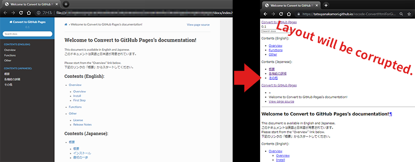

Overview
########

This extension is a tool to solve the problem of broken layout when uploading a web page to GitHub Pages.

------------------------------------------------------------

There are two reasons why the layout is broken.

* GitHub Pages uses `jekyll <http://jekyllrb-ja.github.io/>`_ for hosting by default, so it doesn't correctly read paths that are not supported by jekyll.
* The path specification for CSS and other files is different between server and local, and you need to specify the URL on the GitHub Pages server.

This extension solves the problem as follows.

* Don't host jekyll by putting an empty file ``.nojekyll`` directly under the folder where you publish GithHub Pages.
* Convert relative paths to CSS files in HTML to GitHub Pages URLs using the ``<base>`` tag.

------------------------------------------------------------

| The extension provides the following functionality
| See :ref:`howtouse` / :ref:`detailsfunction` for details.

* Task (Terminal> Run Task...)

  * github pages: Convert to HTML for GitHub Pages
  * github pages: Create a ".nojekyll" file in [./docs]
  * github pages: Create a ".nojekyll" file in [workspaceFolder(./)]

.. figure:: ./../../_images/GitHubPages_doc_002.png
    :alt: image02
    :scale: 100%

.. figure:: ./../../_images/GitHubPages_doc_003.png
    :alt: image03
    :scale: 100%

