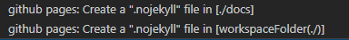
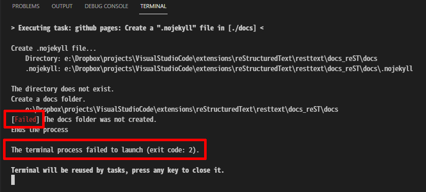

Specification of the Task to create a .nojekyll file
####################################################

次の処理を行います。

1. ``.nojekyll`` ファイルを作成するディレクトリが存在するか確認し、存在しなければ作成します

   * 作成が失敗した場合は処理を終了します (異常終了扱い)

2. ``.nojekyll`` ファイルを作成します

   * 既にファイルが存在していた場合は何も行いません (正常終了扱い)
   * 作成が失敗した場合は、異常終了扱いで処理を終了します

---------------------------------------------------------------------------

Taskを実行しても ``.nojekyll`` ファイルが作成されない場合は、Terminalのメッセージを確認してください。
エラーの原因を特定する唯一の方法です。

[下図] Terminalに ``[Failed]`` や ``The terminal process faild to launch (exit code:2)`` のようなメッセージが表示された場合は、何か問題が起こって処理が中断された事を示しています。

メッセージの内容を確認し、実行環境に問題ないか確認してください。

.. note::
   もし、トラブルが解決できない場合は、 `Issues <https://github.com/TatsuyaNakamori/vscode-ConvertHtmlForGithubPages/issues>`_ に報告してください。バグなどの報告はこのページからのみ受け付けています。

